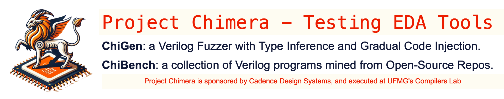
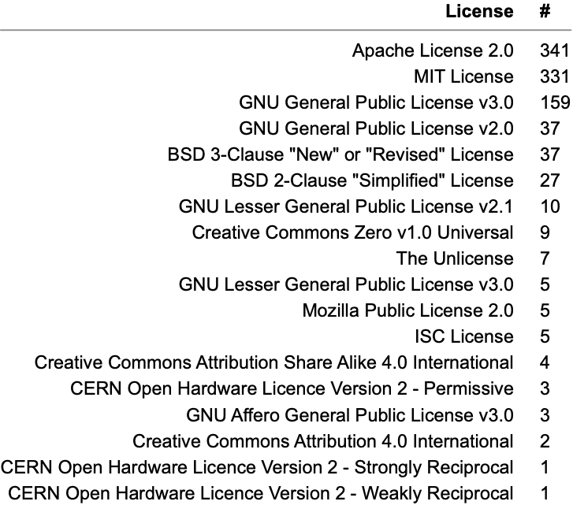

   

## Goals

ChiBench consists of a large collection of Verilog programs mined from open-source github repositories.
The goal of this benchmark suite is to test and debug electronic design automation (EDA) tools, such as the [Jasper Formal Verification Platform](https://www.cadence.com/en_US/home/tools/system-design-and-verification/formal-and-static-verification.html) or [Intel Quartus](https://www.intel.com.br/content/www/br/pt/products/details/fpga/development-tools/quartus-prime.html).
To test your EDA tool, simply pass all the programs in the ChiBench collection to it, and see if it crashes.
Below we list two examples of issues reported in this way:

* [2159](https://github.com/chipsalliance/verible/issues/2159): Verible's [obfuscator](https://github.com/chipsalliance/verible/tree/master/verilog/tools/obfuscator) crashes when reading a program that only contains the pragma directive.
* [2181](https://github.com/chipsalliance/verible/issues/2181): Verible's [parser](https://github.com/chipsalliance/verible/blob/master/verilog/parser/verilog.y) crashes instead of reporting syntax errors related to instantiation type.

## Provenance

ChiBench contains only programs that were originally distributed with some license.
Thus, each program in the ChiBench suite contains, as a header comment, the original license of that specification, plus a link to the repository from where that code was obtained.
Notice that these programs might use different licenses, given that they were extracted from different projects.
On May 24th, 2024, the following licenses were used among the repositories mined to build the ChiBench collection:

 

## Acknowledgment

This project is sponsored by Cadence Design Systems.
Additionally, the different people involved in this project acknowledge the support of [CNPq](https://www.gov.br/cnpq/pt-br), [FAPEMIG](http://www.fapemig.br/pt/), and [CAPES](https://www.gov.br/capes/pt-br).
Finally, thank UFMG's [Department of Computer Science](https://dcc.ufmg.br/) for making available the infrastructure necessary to carry out this project.