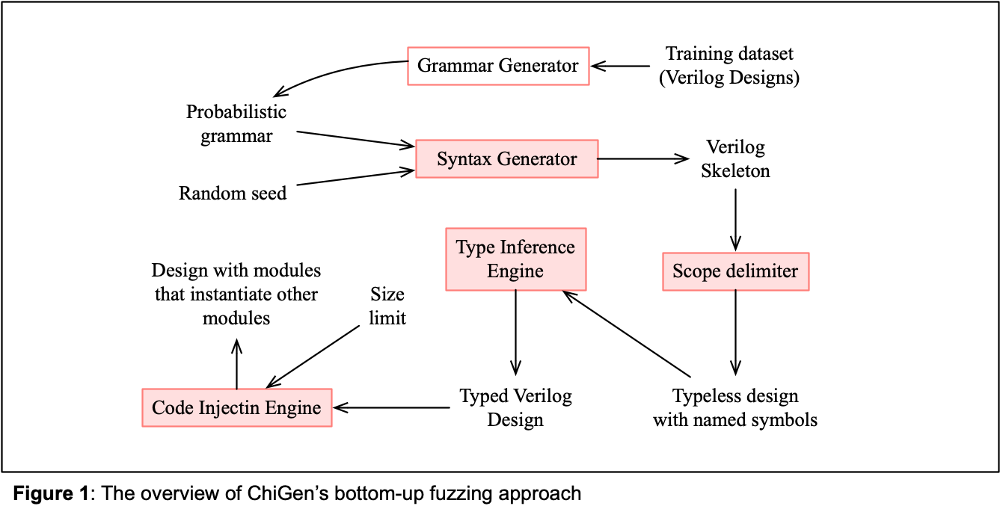
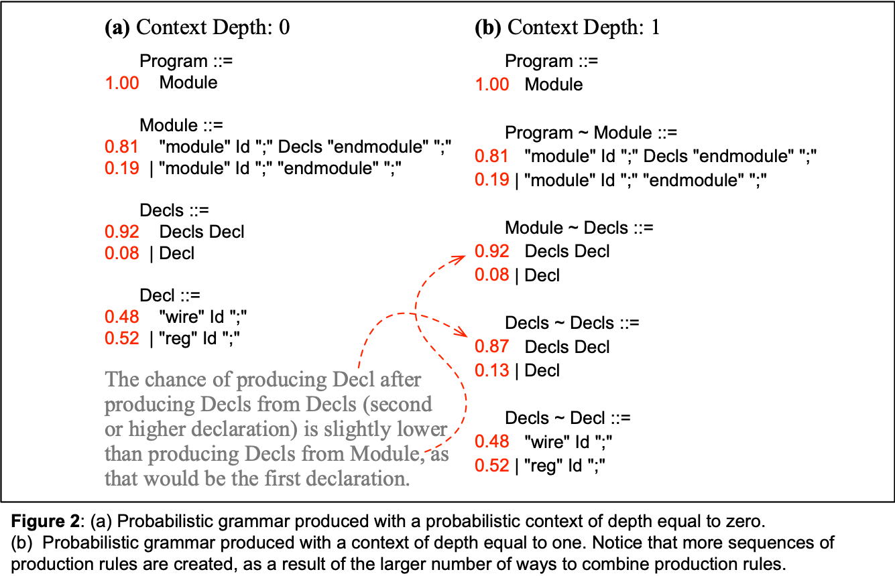
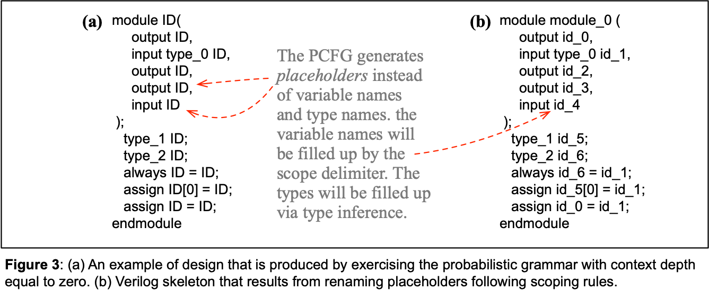
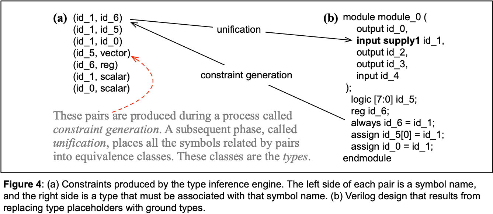
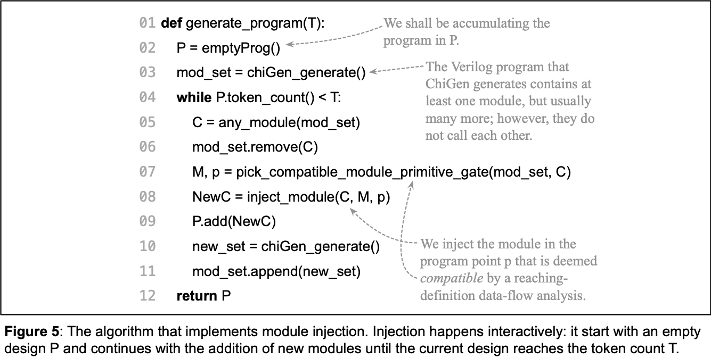
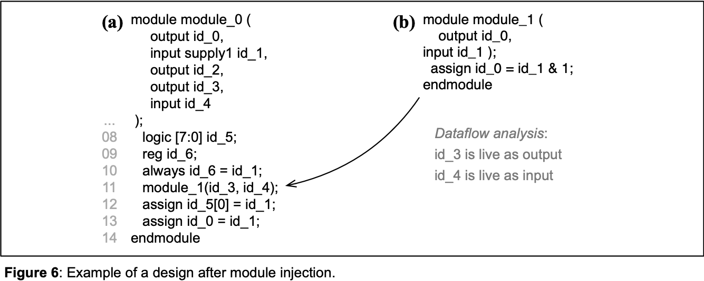

# How ChiGen Works

ChiGen is a "bottom-up" fuzzer: it generates Verilog specifications by first constructing a skeleton of Verilog syntax and then completing this skeleton by inferring names and types.
ChiGen was developed to test the [Jasper Formal Verification Platform](https://www.cadence.com/en_US/home/tools/system-design-and-verification/formal-and-static-verification.html) from [Cadence Design Systems](https://www.cadence.com/en_US/home.html). In October 2024, ChiGen was announced as an open-source tool.

ChiGen operates in four stages, which Figure 1 illustrates:

1. First, it generates the skeleton of a Verilog specification using a probabilistic grammar.
The probabilities associated with production rules can be trained over any number of examples.
2. In the second stage, ChiGen replaces mock identifiers with names that respect scoping rules.
3. After that, ChiGen uses the Hindley-Milner type-inference algorithm, common in functional programming languages, to infer types for these variables.
4. Finally, ChiGen uses a technique called "Module Injection" to combine multiple Verilog modules, thus achieving any number of preset tokens.

These different modules are invoked at the main function, located in [Chimera.cpp](https://github.com/lac-dcc/chimera/blob/main/src/Chimera.cpp).

   

## Syntax Generation via Probabilistic Grammars

To produce a Verilog specification, ChiGen begins by generating a "skeleton" of the design: a structure that adheres to Verilog's syntactic rules. This skeleton is created using a [Probabilistic Context-Free Grammar](https://en.wikipedia.org/wiki/Probabilistic_context-free_grammar) (PCFG), which assigns probabilities to sequences of production rules.
These production rules were taken from Verible's grammar, which contains 456 productions meant to parse the [IEEE 1800-2017 standard](https://ieeexplore.ieee.org/document/8299595).

ChiGen enables conditional dependencies between rule applications, allowing the probability of a given rule to depend on previously selected *K* rules (a K-gram), resulting in "sequence-aware" probabilities.
We limit the probability context *K* - the chain of production rules associated with a probability - to six productions, as each additional context introduces a potentially exponential increase in the table of probabilities.
To construct the PCFG, ChiGen parses a training set of Verilog designs.
It parses each file in this set, recording how often each sequence of productions is used during parsing.
Example 1 shows instances of probabilistic grammars.

**Example 1:**
Figure 2 shows two examples of PCFGs.
The example in Figure 2 (a) does not take context into consideration.
The example in Figure 2 (b) considers contexts of depth one; that is, it can "remember" the rule that led to the production of the current non-terminal that must be expanded.
As an illustration, the chance of increasing a list of declarations decreases, if we know that this list has already one element, as very long chains of declarations are uncommon.

   

**Example 2:**
Figure 3 (a) shows an example of design that is produced by exercising the probabilistic grammar.
Each production rule is activated according to its probabilities.
The starting symbol of the grammar has probability 1.0; hence, syntax generation always starts with a non-null design.
If a rule *A ::= B C* is activated, then it creates two new non-terminals, which will, in turn, be activated too.
Each of these non-terminals might be the left-hand side of multiple productions.
The choice of which production is activated depends on the probabilities associated with them.
This process terminates, as eventually terminals, or the empty string, are produced.

   

**Code base:** The implementation of Chimera's abstract syntax tree is located in [AST.cpp](https://github.com/lac-dcc/chimera/blob/main/src/AST.cpp).
However, the scripts for training the grammar are not implemented in C++; rather, they are mostly written in Python. For an example, take a look into [count_productions.py](https://github.com/lac-dcc/chimera/blob/main/scripts/count_productions.py).

## Variable Renaming and Scope Creation

The design in Figure 3 (a) contains only placeholders where symbol names are expected.
In the next state of code generation, a "scope delimiter" replaces these placeholders with variable names.
Renaming uses a set of "in-scope" variables, and follows three  rules:

1. The declaration of a placeholder is renamed with a new symbol *s*, and *s* is inserted into the set of in-scope elements associated with the current scope.
2. Uses of a placeholder are randomly replaced with any symbol in the set of in-scope elements.
3. Once the scope delimiter leaves a scope region, it removes from the set of in-scope elements the variables declared within that region.

**Code base:** you will find most of the scope delimiter implemented in [IdentifierRenamingVisitor.cpp](https://github.com/lac-dcc/chimera/blob/main/src/IdentifierRenamingVisitor.cpp). However, constants are replaced by a different module, located in [ConstantsReplacerVisitor.cpp](https://github.com/lac-dcc/chimera/blob/main/src/ConstantsReplacerVisitor.cpp).

## Type Inference via Unification

The scope delimiter discussed in the previous section assigns names to variables, but their types remain undefined.
In the subsequent phase of code generation, a "type inference engine" deduces these types. This type inference process follows the well-known [Hindley-Milner](https://en.wikipedia.org/wiki/Hindley%E2%80%93Milner_type_system) algorithm, widely used in languages such as SML/NJ, Haskell, and Rust. However, we adopt the two-stage formulation proposed by [Sulzmann](https://link.springer.com/chapter/10.1007/3-540-44716-4_16): first, we generate constraints; then, we solve these constraints through unification. Each constraint consists of a pair $(t_0, t_1)$, indicating that terms $t_0$ and $t_1$ must share the same type. These terms may represent primitive types or open type variables (such as `type_1` in Figure 3).

**Example 3:**
Figure 4 (a) shows the seven pairs of constraints generated for the design in Figure 3. These pairs are produced by visiting the abstract syntax tree that describes the skeleton code. For instance, the pair $(\mathtt{id\_1}, \mathtt{id\_6})$ is produced because of the assignment `always id_6 = id_1` present in the skeleton. This pair indicates that the type of these two identifiers must be the same. The result of unifying all the pairs appears in Figure 4 (b), where the type placeholders have been replaced with actual type names in this updated version of our running example.

   

Some Verilog skeletons cannot undergo type inference successfully. Type inference may fail if constraints require the unification of two incompatible primitive types, if insufficient constraints are available to determine the type of a variable and we use `wire` as the default type for those cases. When type inference fails, the skeleton is discarded, and the random seed that produced it is used as input to generate a new seed. The failure rate is influenced by the probabilistic grammar used. Most of the grammars in our [JSON](https://github.com/lac-dcc/chimera/tree/main/json) folder will yield a success rate above 70%.

**Code base:** you will find most of the type inference engine implemented in [TypeInference.cpp](https://github.com/lac-dcc/chimera/blob/main/src/TypeInference.cpp).

## Code Expansion via Module Injection

To control the size of Verilog designs generated by ChiGen, we use a technique called *module injection*, following the approach recently introduced by [Li *et al*.](https://dl.acm.org/doi/10.1145/3656386) Module injection involves combining multiple designs to create a new, syntactically and semantically valid design.
Figure 5 illustrates our module injection process.
In Li *et al.*'s original code injection method, a new program $P$ is built by combining two existing programs, $P_0$ and $P_1$, from a real-world project. In contrast, we perform module injection interactively: as shown in Figure 5, we start with an empty design $P$ and continue adding new modules to it until it reaches a preset token count, $T$.

   

Following Li *et al.*'s approach, we use the [reaching definition data-flow analysis](https://en.wikipedia.org/wiki/Reaching_definition) to determine where and how to inject modules into the accumulated program $P$. Reaching definition associates each program point $p \in P$ with the set of variables that reach $p$. A variable $v$ reaches a program point $p$ if the program $P$ contains a path from the definition of $v$ until the point $p$, and $v$ is not redefined along this path.
We can inject a module $M$ at a program point $p \in P$ if, and only if, for each input (respectively, output) parameter $a$ of $M$, there is an input (respectively, output) variable $v$ of equivalent type reaching $p$. When there are multiple such variables, we pick any of them randomly. Our module injection procedure prevents cycles in the final call graph by removing a module from the list of available modules once it is injected, as shown on Line 06 of Figure 5.

One last observation about module injection refers to the fact that we can, at any given time, pick a primitive Verilog gate (`or`, `and`, `xor`, etc) instead of a module in `mod_set` to inject.
The function `pick_compatible_module_primitive_gate` in Line 07 chooses a primitive gate, or a module, based on the probabilities found in the training set used to build the probabilistic grammar.
Notice that primitive gates are not part of `mod_set`, since they are defined in Verilog language; hence, are never removed from the pool of modules available for injection.

**Example 4:**
Figure 6 shows how module injection is enabled by the reaching-definition analysis.
In this example, variables `id_3` and `id_4` reach Line 11 in Figure 6 (a).
These variables are compatible with the signature of `module_1`, which is part of the pool of modules available for injection.
Hence, an instantiation of `module_1` is inserted at Line 11 of `module_0`.

   

**Code base:** The code that computes reaching definitions analysis and inserts modules can be found in [ReachingDefs.cpp](https://github.com/lac-dcc/chimera/blob/main/src/ReachingDefs.cpp).
